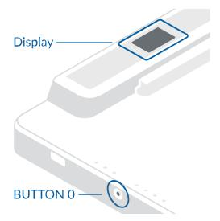
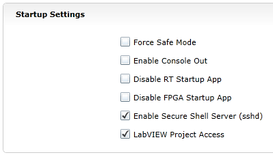
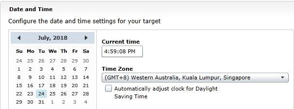
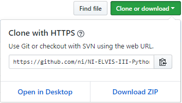
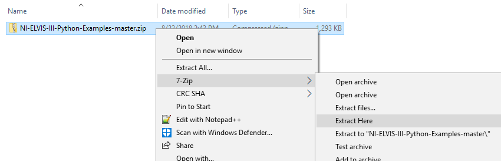
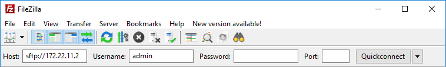
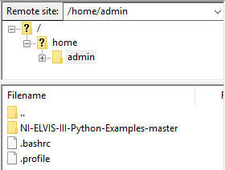

How to use NI ELVIS III with Python
=======
# Overview
In this document we will walk you through the setup, transfer of files, and the use of a Python example on the NI ELVIS III. The NI ELVIS III solution for project-based learning can be programmed with python to help students or educators who are familiar with Python syntax to rapidly acquire measurements by using common SSH clients. Attached to this file are a total of 18 examples which illustrate the use of the NI ELVIS III helper library ([academicIO.py](source/nielvisiii/academicIO.py)).

# Table of Contents
- [Software Setup](#software-setup)
  * [Configuring the NI ELVIS III Device](#configuring-the-ni-elvis-iii-device)
  * [Installing Prerequisite Software for NI ELVIS III Python](#installing-prerequisite-software-for-ni-elvis-iii-python)
  * [Installing NI ELVIS III Python Examples](#installing-ni-elvis-iii-python-examples)
    + [Option 1 - Cloning from GitHub on the Device](#option-1---cloning-from-github-on-the-device)
    + [Option 2 - Download ZIP File and Upload to the Device via SFTP](#option-2---download-zip-file-and-upload-to-the-device-via-sftp)
- [Running the Example](#running-the-example)
- [Examples Overview](#examples-overview)
  * [Analog](#analog)
  * [Bus](#bus)
  * [Digital](#digital)
  * [Interrupt](#interrupt)
- [Opening a Session](#opening-a-session)
- [Function Select Register](#function-select-register)
- [NI ELVIS III Shipping Personality Reference](#ni-elvis-iii-shipping-personality-reference)

<p align="right"><a href="#top">↥ back to top</a>

# Software Setup

## Configuring the NI ELVIS III Device
In this section we will install the NI Measurement Live Support Files and set up the software environment for the NI ELVIS III.

1. Install the [NI Measurement Live Support Files](http://www.ni.com/download/labview-elvis-iii-toolkit-2018/7639/en/).
2. Connect the NI ELVIS III to the Internet by using the Ethernet Port, Wifi, or USB connection so that the Python libraries can be installed from the Internet. We recommend that you use either Ethernet Port or Wifi.
3. Enable the **Secure Shell Server**.
   1. Open Internet Explorer and visit the NI ELVIS III Configuration website: \<IP Address of the NI ELVIS III\>/WIF.html<br/>
      <br/>
      Note: The IP Address can be found on the display of the NI ELVIS III. Press BUTTON 0 until the IP address appears. Enter the IP address from the display.<br />
      
   2. Navigate to thetab at the left of the page if not already there.
   3. Enable the **Secure Shell Server (sshd)** checkbox in the **Startup Settings** section.
       
   4. Click **Save**.
4. Set up **Time Configuration**.
   On the NI ELVIS III configuration website:
   1. Click on the  tab at the left of the page .
   2. Configure the **Date**, **Current time**, and **Time Zone** to your current local time.
      
      
      Note: Make sure there is a blue mark at the date you selected.
      
   3. Click **Save**.
5. Restart the device.

## Installing Prerequisite Software for NI ELVIS III Python
In this section we will install the software needed to execute the NI ELVIS III Python examples and the required packages to use the Python FPGA API.

1. Install and open your favorite SSH client. If you do not have one, we recommend that you use [PuTTY](https://the.earth.li/~sgtatham/putty/latest/w32/putty.exe): 
   - Configure PuTTY or another client as follows:
    
     
        
      - **Host Name**: \<IP Address of the NI ELVIS III\>
      - **Port**: 22
      - **Connection Type**: SSH
   - Click **Open**.
   - Once the connection opens, log in as:
       - **login as**: admin
       - **Password**: (Just press **Enter**. There is no password by default.)
2. Install prerequisite software by running the following commands:<br />
   
   Note: **Time configuration** must be set before running these commands. If you got any error when downloading **nifpga**, make sure your **Time configuration** of the NI ELVIS III is set correctly.
   
   ```
   opkg update
   opkg install python
   opkg install python-pip
   pip install nifpga
   pip install pyvisa
   ```

## Installing NI ELVIS III Python Examples 

In this section we will download the NI ELVIS III Python Examples. You are free to choose any option you are comfortable with to install NI ELVIS III Python Examples.

### Option 1 - Cloning from GitHub on the Device

1. Open PuTTY, install `git` on the NI ELVIS III device.

   ```
   opkg install git
   ```
2. Download the NI ELVIS III Python helper library and Python Example from GitHub.
   - Download NI ELVIS III Python.
   
     ```
     git clone https://github.com/ni/NI-ELVIS-III-Python-Examples.git
     ```
   - You can now find **NI-ELVIS-III-Python-Examples** in your current directory. The default directory is `/home/admin`.

<p align="right"><a href="#top">↥ back to top</a>

### Option 2 - Download ZIP File and Upload to the Device via SFTP

1. Open the [NI ELVIS III Python Examples](https://github.com/ni/NI-ELVIS-III-Python-Examples) on GitHub.
2. Download the NI ELVIS III Python helper library and Python Examples from GitHub and upzip it.
   1. Click **Clone or download**.
   2. Click **Download ZIP**.

      
   
   3. Click **Extract Here** to unzip **NI-ELVIS-III-Python-Examples-master.zip** which is the file you just downloaded.
   
      
      
3. Transfer the NI ELVIS III Python Examples to your NI ELVIS III device.
   1. Download and install [FileZilla](https://filezilla-project.org/download.php). You are free to use any application you are comfortable with to transfer files.
   2. Configure FileZilla as the following:
   
      
      
      - **Host**: \<IP Address of the NI ELVIS III\>
      - **Username**: admin
      - **Password**: (Blank. There is no password by default.)
      - **Port**: 22

   3. Click **Quickconnect**.
   4. Upload **NI-ELVIS-III-Python-Examples-master/** into the directory `/home/admin`.
   
      

<p align="right"><a href="#top">↥ back to top</a>

# Running the Example

1. In the same directory where you clone from GitHub in the earlier session, change the directory to the NI-ELVIS-III-Python example.

   For GitHub Cloning Method:
   ```
   cd NI-ELVIS-III-Python-Examples/
   ```
   For FileZilla Method:
   ```
   cd NI-ELVIS-III-Python-Examples-master/
   ```
2. Run the example:

   ```
   python examples/<example_category>/<example_filename>.py
   ```
   For example: `python examples/analog/AI_singleChannel.py`.      
   
   Note: Make sure your application broad is powered on before running any example.

<p align="right"><a href="#top">↥ back to top</a>

# Examples Overview
  Go to the comments area at the top of each example to see more details. Click the following links to jump into the example page.

 ### [Analog](examples/analog)
   - [AI_configurationOptions](examples/analog/AI_configurationOptions.py)
   - [AI_multipleChannels](examples/analog/AI_multipleChannels.py)
   - [AI_singleChannel](examples/analog/AI_singleChannel.py)
   - [AO_multipleChannels](examples/analog/AO_multipleChannels.py)
   - [AO_singleChannel](examples/analog/AO_singleChannel.py)
 ### [Bus](examples/bus)
   - [Encoder](examples/bus/Encoder.py)
   - [I2C](examples/bus/I2C.py)
   - [SPI](examples/bus/SPI.py)
   - [UART](examples/bus/UART.py)
 ### [Digital](examples/digital)
   - [Button](examples/digital/Button.py)
   - [DIO_multipleChannels](examples/digital/DIO_multipleChannels.py)
   - [DIO_singleChannel](examples/digital/DIO_singleChannel.py)
   - [LED](examples/digital/LED.py)
   - [PWM](examples/digital/PWM.py)
 ### [Interrupt](examples/interrupt)
   - [AIIRQ (Analog Interrupt)](examples/interrupt/AIIRQ.py)
   - [ButtonIRQ (Button Interrupt)](examples/interrupt/ButtonIRQ.py)
   - [DIIRQ (Digital Interrupt)](examples/interrupt/DIIRQ.py)
   - [TimerIRQ (Timer Interrupt)](examples/interrupt/TimerIRQ.py)

<p align="right"><a href="#top">↥ back to top</a>

# Opening a Session

A context manager ('with' statement) is a convenient way to open/close an NI ELVIS III FPGA session. 
```python
with academicIO.AnalogInput({'bank': ai_bank,
                             'channel': ai_channel,
                             'range': ai_range,
                             'mode': ai_mode}) as AI_single_channel:
```
It is always recommended that you use a context manager to open/close an NI ELVIS III FPGA session. The program will automatically initialize the environment of NI ELVIS III FPGA at the beginning and will automatically free its resources after the 'with' statement ends. Opening a session without a context manager could increase the risk of leaking the session.

See [compound statements](https://docs.python.org/2.7/reference/compound_stmts.html#the-with-statement) for more details about the context manager.

You can also manually open/close an NI ELVIS III FPGA session by using the following commands:
```python
# open a session
AI_single_channel = academicIO.AnalogInput()

# close a session
AI_single_channel.close()
```
If you don’t call the `close()` function after the Python program closes, you may leak the session and cause errors when you run the program again. If you want the FPGA to keep executing the code after the Python program ends, do not call the `close()` function in the Python program.

<p align="right"><a href="#top">↥ back to top</a>

# Function Select Register

- DIO:      DIO [0:19] on bank A and bank B
- PWM:      DIO [0:19] on bank A and bank B
- Encoder:  DIO [0:1], DIO [2:3], …, DIO [18:19] on bank A and bank B
- SPI:      DIO [5:7] on bank A and bank B
- I2C:      DIO [14:15] on bank A and bank B
- UART:     DIO [16:17] on bank A and bank B

|**NI ELVIS III**| DIO | PWM | Encoder | SPI | I2C | UART | 
|:--------------:|:-----------:|:-----------:|:---------------:|:-----------:|:------------------------:|:----------:| 
| **DIO 0**      | DIO 0       | PWM 0       | ENC.A 0         |             |                          |            | 
| **DIO 1**      | DIO 1       | PWM 1       | ENC.B 0         |             |                          |            | 
| **DIO 2**      | DIO 2       | PWM 2       | ENC.A 1         |             |                          |            | 
| **DIO 3**      | DIO 3       | PWM 3       | ENC.B 1         |             |                          |            | 
| **DIO 4**      | DIO 4       | PWM 4       | ENC.A 2         |             |                          |            | 
| **DIO 5**      | DIO 5       | PWM 5       | ENC.B 2         | SPI.CLK     |                          |            | 
| **DIO 6**      | DIO 6       | PWM 6       | ENC.A 3         | SPI.MISO    |                          |            | 
| **DIO 7**      | DIO 7       | PWM 7       | ENC.B 3         | SPI.MOSI    |                          |            | 
| **DIO 8**      | DIO 8       | PWM 8       | ENC.A 4         |             |                          |            | 
| **DIO 9**      | DIO 9       | PWM 9       | ENC.B 4         |             |                          |            | 
| **DIO 10**     | DIO 10      | PWM 10      | ENC.A 5         |             |                          |            | 
| **DIO 11**     | DIO 11      | PWM 11      | ENC.B 5         |             |                          |            | 
| **DIO 12**     | DIO 12      | PWM 12      | ENC.A 6         |             |                          |            | 
| **DIO 13**     | DIO 13      | PWM 13      | ENC.B 6         |             |                          |            | 
| **DIO 14**     | DIO 14      | PWM 14      | ENC.A 7         |             | I2C.SCL                  |            | 
| **DIO 15**     | DIO 15      | PWM 15      | ENC.B 7         |             | I2C.SDA                  |            | 
| **DIO 16**     | DIO 16      | PWM 16      | ENC.A 8         |             |                          | UART.RX    | 
| **DIO 17**     | DIO 17      | PWM 17      | ENC.B 8         |             |                          | UART.TX    | 
| **DIO 18**     | DIO 18      | PWM 18      | ENC.A 9         |             |                          |            | 
| **DIO 19**     | DIO 19      | PWM 19      | ENC.B 9         |             |                          |            |

<p align="right"><a href="#top">↥ back to top</a>

# NI ELVIS III Shipping Personality Reference 

This document contains reference information about the NI ELVIS III shipping personality. The reference includes information about the registers used to control the peripherals of NI ELVIS III.

You can find NI ELVIS III Shipping Personality Reference [here](docs/NI_ELVIS_III_Shipping_Personality_Reference.md).

<p align="right"><a href="#top">↥ back to top</a>
