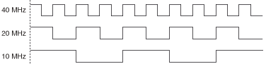

## Generating FPGA Clocks (ELVIS III Toolkit)

The FPGA target on the hardware has a clock rate of 40 MHz, which means the clock cycle is 25 ns. To generate a frequency that is less than 40 MHz, you can change a signal on every x number of rising edges of the clock signal. The following figure shows an example of changing a 40 MHz clock signal on rising edges to generate 20 MHz and 10 MHz clock signals, respectively.

In the previous figure, you toggle the clock signal on every rising edge to generate the 20 MHz clock signal and toggle the clock signal on every other rising edge to generate the 10 MHz clock signal.

The frequency to generate on the hardware must meet the following requirements:
 - The frequency must be divisible by 25 ns because the clock cycle is 25 ns and you count the number of rising edges to make changes. For example, you cannot generate a frequency of 25 MHz. The first achievable frequency below 40 MHz is 20 MHz. 
 - The frequency must be within the range of approximately 610.35 Hz to 40 MHz. The hardware uses a 16-bit counter that counts from 0 to 65,535. You can calculate the lowest achievable frequency by the equation 1/(25 ns * 65536) ≈ 610.35 Hz. 

You can use clock divisors to generate even lower frequencies for different I/O types. You can divide the base frequency by even numbers and use the generated clock to increment the counter. For example, with a clock divisor of 2, the lowest achievable frequency is 1/(2 * 25 ns * 65536) ≈ 305.17 Hz.

#### The following equation calculates frequencies that you can generate for pulse width modulation (PWM) I/O.

fPWM = fclk / (N * [X + 1])  
where
 - fPWM is the desired PWM frequency
 - fclk is the base clock frequency
 - N is the clock divisor
 - X is the number of counts before changing the signal

#### The following equation calculates frequencies that you can generate for serial peripheral interface (SPI) I/O.

fSPI = fclk / (2 * N * [X + 1])

where
 - fSPI is the desired SPI frequency 
 - fclk is the base clock frequency 
 - N is the clock divisor 
 - X is the number of counts before changing the signal 
