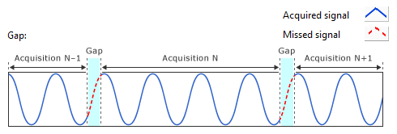
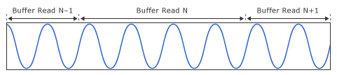
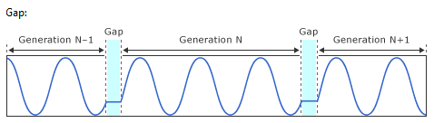
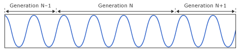

## Understanding Gaps

### Analog Input

The following figure illustrates the gap between sequential n samples acquisitions when using the Analog Input APIs. 

In the previous figure, the x-axis represents time and the y-axis represents amplitude. The waveform in blue represents the signal that the hardware acquires. Gaps in the acquired signal exist between sequential calls of the Analog Input (n samples) APIs. During the gap, the hardware does not acquire any signal. The duration of the gap between acquisitions is software dependent and varies from iteration to iteration.

Note: You need to choose an FPGA personality that supports n samples I/O mode to perform n samples read operations. 

If you want to create a continuous acquisition without data loss, specify **Analog input (continuous)** for I/O mode. The following figure illustrates a continuous acquisition:

### Analog Output

The following figure illustrates the gap between sequential n samples signal generations when using the Analog Output APIs.

In the previous figure, the x-axis represents time and the y-axis represents amplitude. Gaps in the generated signal exist between sequential calls of the Analog Output (n samples) APIs. During the gap, the output signal holds the last generated voltage of the previous generation iteration. The duration of the gap between signal generations is software dependent and varies from iteration to iteration.

Note: You need to choose an FPGA personality that supports n samples I/O mode to perform n samples write operations. 

If you want to create a continuous signal generation without data loss, specify **Analog output (continuous)** for I/O mode. The following figure illustrates a continuous signal generation:

### Related Information

[1 Sample, N Samples, and Continuous Modes](./1_Sample_N_Samples_and_Continuous_Modes.md)

[I/O Connectors (ELVIS III)](http://www.ni.com/documentation/en/ni-elvis-iii/latest/controlio/controlio/)